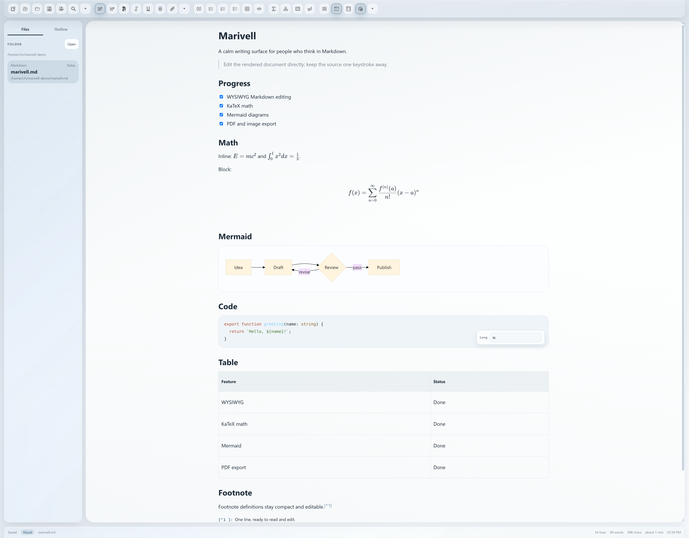
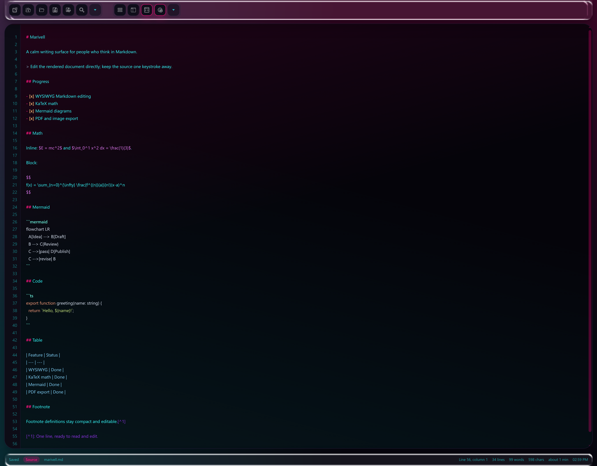

<div align="center">

# Marivell

**A calm, local-first Markdown workspace with live math, diagrams, and glass UI.**

[](https://github.com/BruceCui7193/marivell/releases)
[](LICENSE)
[](https://github.com/BruceCui7193/marivell/actions)

</div>



Marivell is a WYSIWYG Markdown editor for people who want the fluid feel of a document editor and the full control of Markdown. It is built with Electron, React, TypeScript, Tiptap, KaTeX, and Mermaid, and keeps your files local-first by default.

## The Editor



One maximized workspace shows task lists, KaTeX math, Mermaid diagrams, code, tables, footnotes, folder navigation, and the full toolbar. Source mode keeps raw Markdown, line numbers, and syntax highlighting one keystroke away.

## Why Marivell

- **WYSIWYG editing.** Edit the rendered document directly, instead of maintaining a separate preview pane.
- **Math that reads like math.** Inline and block LaTeX are rendered with KaTeX while you work.
- **Diagrams inside the document.** Mermaid charts stay editable and render in place.
- **Source mode when you need it.** Raw Markdown, line numbers, and syntax highlighting are one keystroke away.
- **Calm, configurable surfaces.** Frosted or liquid glass UI, light and dark modes, and multiple color palettes.
- **Local-first workflow.** Open folders, browse files, paste images, detect external changes, and export without a cloud account.

## Features

| Area | What Marivell does |
| --- | --- |
| Markdown | Headings, lists, task lists, blockquotes, tables, code blocks, links, footnotes, HTML blocks |
| Math | `$...$`, `$$...$$`, `\\(...\\)`, `\\[...\\]`, KaTeX rendering and LaTeX syntax highlighting |
| Diagrams | Mermaid flowcharts, sequence diagrams, state diagrams, Gantt charts, and more |
| Files | Folder sidebar, file tree, document outline, external change detection, multi-window |
| Images | Drag-and-drop, paste, save to document folder, save to default library, keep original path |
| Appearance | Light, dark, system theme; natural, forest, bay, warm paper, graphite, aurora, sakura, lavender, cyberpunk palettes; frosted glass, liquid glass, or solid UI |
| Export | PDF, 2x long image, and Pandoc formats: DOCX, HTML, EPUB, LaTeX, ODT, RTF, PPTX, plain text, GFM |
| Source mode | Raw Markdown editor with line numbers, search, go-to-line, and syntax highlighting |

## Quick Start

### Linux

From source, build and install the latest version:

```bash
sudo npm run install:linux
```

If a release package is preferred, install the `.deb` or AppImage from [Releases](https://github.com/BruceCui7193/marivell/releases).

### Windows

Download the Windows installer from [Releases](https://github.com/BruceCui7193/marivell/releases). The installer includes an optional `.md` / `.markdown` file association, checked by default.

### Open a Markdown file

After installation you can open files from the terminal:

```bash
marivell document.md
```

## Development

Requirements: Node.js 20+, npm 10+.

```bash
npm install
npm run dev
```

## Test

```bash
npm test
```

The suite covers Markdown round-trips, source/visual mode switching, history, clipboard behavior, math, code blocks, images, footnotes, task lists, workflow stress cases, and packaging assets. GitHub Actions runs the same tests before building releases.

## Build

```bash
# Linux packages
npm run build:linux

# Windows installer
npm run build:win

# Local Linux unpacked build
npm run build:linux:dir
```

## File Associations

`.md` and `.markdown` file association configuration lives in [electron-builder.config.mjs](electron-builder.config.mjs).

- Windows: the NSIS installer can register `.md` / `.markdown` with Marivell and uses the custom document icons.
- Linux: the installer registers the MIME types and installs Markdown icons, so file managers show `.md` / `.markdown` files with Marivell icons and list Marivell in **Open With**.

## Keyboard Shortcuts

| Action | Shortcut |
| --- | --- |
| Save | `Ctrl+S` |
| Search / replace | `Ctrl+F` |
| Source mode | `Ctrl+Shift+E` |
| Export PDF | `Ctrl+Shift+P` |
| Export image | `Ctrl+Shift+I` |
| Toggle theme | `Ctrl+Shift+L` |
| Toggle sidebar | `Ctrl+\` |
| New window | `Ctrl+N` |
| Open file | `Ctrl+O` |
| Bold | `Ctrl+B` |
| Italic | `Ctrl+I` |

## Project Layout

```text
src/
  main/        Electron main process, desktop integration, export pipeline
  preload/     IPC bridge
  renderer/    React UI, editor, themes, clipboard, liquid glass
  shared/      Shared contracts and types
build/         Icons, desktop files, installer assets
tests/         Markdown fixtures and shared test assets
scripts/       Build, install, and test scripts
```

A ready-to-open demo document is available at [docs/demo/marivell.md](docs/demo/marivell.md).

## Tech Stack

Electron, electron-vite, React, TypeScript, Tiptap/ProseMirror, KaTeX, Mermaid, lowlight, remark, pngjs, electron-builder.

## License

MIT
