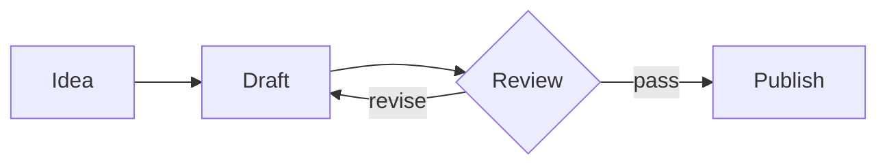

# Marivell

A calm writing surface for people who think in Markdown.

> Edit the rendered document directly; keep the source one keystroke away.

## Progress

- [x] WYSIWYG Markdown editing
- [x] KaTeX math
- [x] Mermaid diagrams
- [x] PDF and image export

## Math

Inline: $E = mc^2$ and $\int_0^1 x^2 dx = \frac{1}{3}$.

Block:

$$
f(x) = \sum_{n=0}^{\infty} \frac{f^{(n)}(a)}{n!}(x-a)^n
$$

## Mermaid



## Code

```ts
export function greeting(name: string) {
  return `Hello, ${name}!`;
}
```

## Table

| Feature | Status |
| --- | --- |
| WYSIWYG | Done |
| KaTeX math | Done |
| Mermaid | Done |
| PDF export | Done |

## Footnote

Footnote definitions stay compact and editable.[^1]

[^1]: One line, ready to read and edit.
